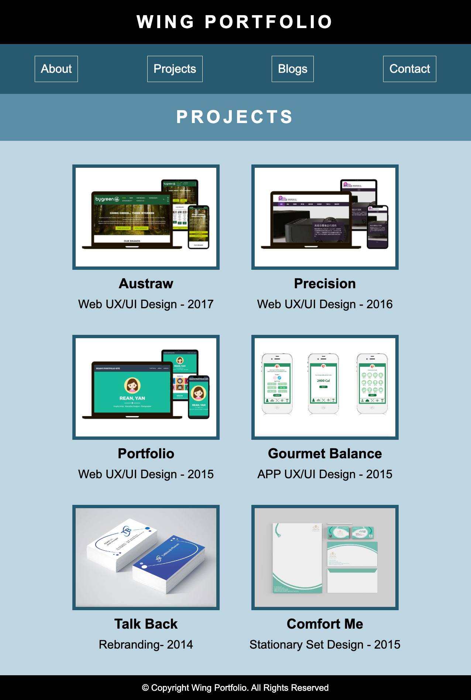

# Wing Portfolio Site

## A link to my published portfolio website

https://wing-lo.netlify.app/

## A link to my GitHub repository

Open the [Github](https://github.com/Wing-Lo/portfolio) for Wing's portfolio

## Description of my portfolio website

The main aim of this website is to showcase my skills and expertise to potential employers. I plan to create a professional portfolio site that highlights my knowledge in web development, IT areas, and coding experience. Through this platform, I aim to provide a comprehensive overview of my capabilities and demonstrate my proficiency in these fields effectively.

## Functionality / Features

The portfolio website I've developed features a fully responsive layout, ensuring seamless display across all devices, including desktops, mobile phones, and tablets. It comprises five main HTML pages, each serving a distinct purpose: Home, About, Projects, Blogs, and Contact. These pages provide potential employers with comprehensive insights into my skills, experience, educational background, and past projects. The functionality of the site is further enhanced with a fixed position for the home button and navigation bar, ensuring they remain sticky on top for easy access and navigation to different pages at any time. This user-friendly and informative platform serves as a compelling showcase of my talents and achievements, facilitating easy navigation and engagement for visitors.

## Screenshots

### Mobile view 

### Tablet view

### Laptop view

### Wireframe view

## Sitemap

The website's structure is designed with user-friendly navigation in mind. The home page button and navigation bar are fixed on the top of every page, ensuring easy access regardless of scrolling position. Visitors can seamlessly transition between pages by clicking on the navigation buttons: Home (Wing Portfolio), About, Projects, Blogs, and Contact.

Once on the Blog page, visitors can explore individual blog posts by clicking on their respective titles to access the full content. To facilitate further exploration, recent blog links are provided at the bottom of each post, enabling visitors to navigate to other posts of interest with ease. This intuitive structure ensures a smooth and engaging browsing experience, allowing visitors to effortlessly discover and interact with the website's content.

## Target audience

The target audience for this portfolio website consists of potential employers seeking a skilled web developer.

## Tech stack

- Website: HTML & CSS
- Sitemap: app.diagrams.net
- Wireframe: Figma
- Deployment platform: Netlify
- Version control: Github

## List of components

1. Header with home button and nav bar for visitor to navigate to different pages at any time
2. Home page: profile pic with my name, title and tagline for visitors to have a better image of me and what I can do for them as a web developer
3. Footer on each page with the copyright statement.
4. About page: profile pic with a description for visitors to know more abour me.
5. About page: my skills in cicrle to emphasize what i can do in a clear way.
6. About page: my experiences and education in rectangle showing the history of myself.
7. About page: resume button with link to a pdf resumes so my potential employees can take a further step to know more about me.
8. Project page: Images of my past projects with a title, platform and the project date to showcase what i have done in past.
9. Blog page: a list of 5 blog posts with images, heading and published date so the visitors can easily pick on the topic that they are interested in and head to the next page to see the full article.
10. Blog content page: a page for the full article with an image, heading, published date and links at the bottom for the visitors to navigate to other blog posts without jumping back to the blog page.
11. Contact page: a email link for my potential employees to contact me easily.
12. Contact page: 4 social media icons with links for visitors to get in touch with me through linkedin, twitter, facebook and github.